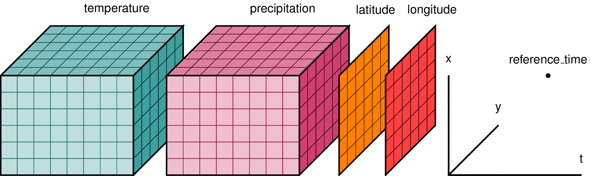

The Network Common Data Form (NetCDF) is a set of libraries and self-describing machine-independent data formats that support the creation, access, 
and sharing of array-oriented scientific data. NetCDF was developed and is maintained at Unidata, part of the University Corporation for Atmospheric 
Research (UCAR) Office of Programs (UOP). Unidata is funded primarily by the National Science Foundation.

Pandas does not have native support for reading/writing NetCDF, however there are a number of additional packages that provide this capability:

- netcdf4-python: a Python interface to the NetCDF library
- PyNIO: a Python package that allows read and/or write access to a variety of data formats using an interface modeled on NetCDF
- xarray: provides N-dimensional variants of the core pandas data structures

## NetCDF Data Model

The "classic" NetCDF data model consists of the following components:

- Variables: N-dimensional arrays of data. Variables in NetCDF files can be one of six types (char, byte, short, int, float, double).
- Dimensions: These describe the axes of the data arrays. A dimension has a name and a length. An unlimited dimension has a length that can be expanded at any time, as more data are written to it. NetCDF files can contain at most one unlimited dimension.
- Attributes: These annotate variables or files with small notes or supplementary metadata. Attributes are always scalar values or 1D arrays, which can be associated with either a variable or the file as a whole. Although there is no enforced limit, the user is expected to keep attributes small.

In addition, the "common data model" introduced in NetCDF-4 includes the following:

- Groups: These provide a way of hierarchically organizing data, similar to directories in a Unix file system.
- User-defined types: These allow the definition of compound types (like C structures), enumeration types, variable length arrays, and opaque types.

## Meteorological Example

NetCDF can be used to store many kinds of data, but it was originally developed for the Earth science community.

NetCDF views the world of scientific data in the same way that an atmospheric scientist might: as sets of related arrays. There are various physical quantities (such as pressure and temperature) located at points at a particular latitude, longitude, vertical level, and time. A scientist might also like to store supporting information, such as the units, or some information about how the data were produced.

The axis information (latitude, longitude, level, and time) would be stored as NetCDF dimensions. Dimensions have a length and a name.

The physical quantities (pressure, temperature) would be stored as NetCDF variables. Variables are N-dimensional arrays of data, with a name and an associated set of NetCDF dimensions.

It is also customary to add one variable for each dimension, to hold the values along that axis. These variables are call “coordinate variables.” The latitude coordinate variable would be a one-dimensional variable (with latitude as its dimension), and it would hold the latitude values at each point along the axis.

The additional bits of metadata would be stored as NetCDF attributes. Attributes are always single values or one-dimensional arrays. (This works out well for a string, which is a one-dimensional array of ASCII characters.)



## netCDF4 Package

Although there are a number of packages for reading NetCDF files, we will just be working with `netcdf4-python` for this tutorial.

### Opening a file

To open a NetCDF file from Python, you simply call the Dataset() constructor as follows (a sample data set is available [here](../data/sresa1b_ncar_ccsm3-example.nc)):

```python
from netCDF4 import Dataset 
dataset = Dataset('sresa1b_ncar_ccsm3-example.nc')
print(dataset.file_format)
```

### Working with "Classic" NetCDF

The netCDF4 module can read in any NetCDF format. This tutorial will focus exclusively on the NetCDF-
"classic" data model, which is contains only dimensions, variables and attributes only. When you
print out the `file_format` attribute, you can see that the file is in `NETCDF3_CLASSIC` mode.

### Interrogating Dimensions

You can interrogate dimensions using simple dictionary calls:

```python
print(dataset.dimensions.keys())
print(dataset.dimensions['time'])
```

This would result in the output:

```
['lat', 'lon', 'bnds', 'plev', 'time']
<class 'netCDF4._netCDF4.Dimension'> (unlimited): name = 'time', size = 1
```

### Interrogating Variables

You can interrogate variables using simple dictionary calls:

```python
for key in dataset.variables.keys():
  var = dataset.variables[key]
  print("name=" + var.name + ", shape=" + str(var.shape))
```

This would result in the output:

```
name=area, shape=(128, 256)
name=lat, shape=(128,)
name=lat_bnds, shape=(128, 2)
name=lon, shape=(256,)
name=lon_bnds, shape=(256, 2)
name=msk_rgn, shape=(128, 256)
name=plev, shape=(17,)
name=pr, shape=(1, 128, 256)
name=tas, shape=(1, 128, 256)
name=time, shape=(1,)
name=time_bnds, shape=(1, 2)
name=ua, shape=(1, 17, 128, 256)
```

Notice that you can access a variable by its key:

```python
var = dataset.variables['pr']
print(" dims =", var.dimensions)
print(" shape =", var.shape)
print(" size =", var.size)
print(" ndim =", var.ndim)
print(" datatype =", var.datatype)
```

Which would result in:

```
 dims = ('time', 'lat', 'lon')
 shape = (1, 128, 256)
 size = 32768
 ndim = 3
 datatype = float32
```

### Global Attributes

Global attributes are available as attributes of the `Dataset` instance (more about classes and attributes later):

```python
# Find all NetCDF global attributes
print(dataset.ncattrs())
for attr in dataset.ncattrs():
    print(attr, '=', getattr(dataset, attr))
```

Results in:

```
['CVS_Id', 'creation_date', 'prg_ID', 'cmd_ln', 'history', 'table_id', 'title', 'institution', 'source', 'contact', 'project_id', 'Conventions', 'references', 'acknowledgment', 'realization', 'experiment_id', 'comment', 'model_name_english']
CVS_Id = $Id$
creation_date = 
prg_ID = Source file unknown Version unknown Date unknown
cmd_ln = bds -x 256 -y 128 -m 23 -o /data/zender/data/dst_T85.nc
...
```

if you know the name of an attribut, you can access it directly:

```python
print(dataset.title)
```

### Variable Attributes

Variable attributes are available as attributes of the `Variable` instance:

```python
var = dataset.variables['pr']
# Get units attribute
print(var.units)
# Find all variable attributes
for attr in var.ncattrs():
    print(attr, '=', getattr(var, attr))
```

Results in:

```
kg m-2 s-1
comment = Created using NCL code CCSM_atmm_2cf.ncl on
 machine eagle163s
missing_value = 1e+20
_FillValue = 1e+20
cell_methods = time: mean (interval: 1 month)
history = (PRECC+PRECL)*r[h2o]
original_units = m-1 s-1
original_name = PRECC, PRECL
standard_name = precipitation_flux
units = kg m-2 s-1
long_name = precipitation_flux
cell_method = time: mean
```

> ## Challenge
> Write a Python script to open the CMIP5 global emissions data set. Call the script `historical_co2_emissions.py`. Use your knowledge of netCDF4 to answer
> the following questions:
> 
> 1. How many dimensions does the data set contain? What are the sizes of the dimensions?
> 2. How many variables does the data set contain, and what are their names and dimensions?
> 3. What do you think the purpose of the 'FF' variable is?
{: .challenge}

## Accessing Data

Once a NetCDF data set is loaded, it is possible to access the data as if it was a NumPy array using array slice notation. We can use the `dimensions` attribute to see how the data is stored:


```python
pr = dataset.variables['pr']
print(pr.dimensions)
pr_np = pr[:,:,:]
print(type(pr_np))
print(pr_np)
```

Results in:

```
('time', 'lat', 'lon')
<class 'numpy.ndarray'>
[[[  1.09154621e-06   1.05453501e-06   1.07892288e-06 ...,   1.19990307e-06
     1.18260778e-06   1.11406700e-06]
  [  8.50919207e-07   8.01471970e-07   7.74396426e-07 ...,   8.93815013e-07
     8.46728483e-07   8.41070630e-07]
  [  7.78378194e-07   7.64248853e-07   7.55447502e-07 ...,   8.13378392e-07
     7.91471564e-07   7.89699868e-07]
  ..., 
  [  9.11267216e-06   9.23918469e-06   9.17026045e-06 ...,   9.26296707e-06
     9.18914975e-06   9.14246812e-06]
  [  1.10062556e-05   1.11204690e-05   1.11354339e-05 ...,   1.14826926e-05
     1.16207366e-05   1.14265431e-05]
  [  1.03569955e-05   1.01802771e-05   9.95330629e-06 ...,   1.03063812e-05
     1.03916263e-05   1.05708477e-05]]]
```

We can use the normal NumPy operations on the resulting array:

```python
print(pr_np.mean(axis=1))
```
