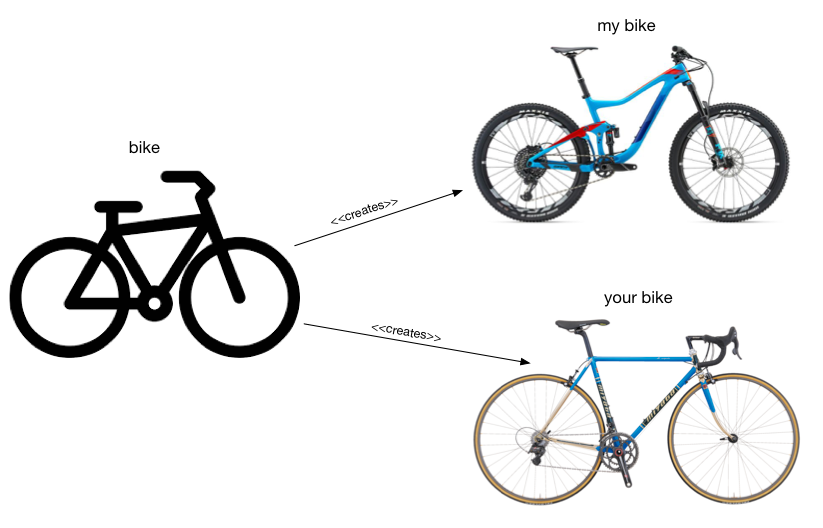
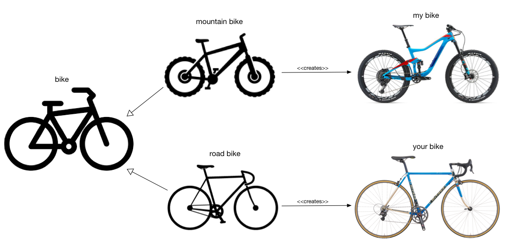

Now that we have decided how the data should be stored in a useful format, it makes sense to structure the program 
so that we can easily reuse the data for our analysis purposes. We could do this using Python functions, but a much
better approach is to use object oriented (OO) programming and *classes*.

## OO: A Very Brief Primer

Why use OO? There are many opinions about the benefits or otherwise of OO programming, but there are two clear motivating
factors. The first is that it helps deal with the inherent complexity of software through abstraction. This closely 
matches with how we deal with complexity in other areas. The second is that it significantly improves reuse, which has 
many benefits for maintaining code, and makes it easier to understand, troubleshoot, and debug the code.

There are three main concepts that are key to object oriented programming:

- Objects
- Classes
- Inheritance

### Objects

In OO, an object encapsulates two concepts: *state* and *behavior*.

State information is the data that the object holds, much like the data stored in a variable. In Python, state information is know as the
*attributes* of an object. Other languages uses different terminology (e.g. fields), but it means the same thing.

Behavior is exposed through functions that can be called to modify the state information, or perform other actions. These functions are
known as *methods* when they are associated with an object.

It many languages, it is common to hide internal state and make it accessible only through methods, sometimes called *getters* and *setters*
(because they *get* the state or *set* the state.) Python doesn’t really do this. Attributes are often accessed directly, like `dataset.columns`
on a `DataFrame`. 

### Classes

A class can be thought of as a blueprint for creating an object. Since many objects share the same characteristics (people, cars, etc.) a class 
serves as a prototype that specifies the state and behavior of objects created using the class.

When an object is created based on a prototype like this, it is called an *instance* of that class.
So if “bike” is a class or blueprint that specifies the state (the currently selected gear) and behavior (changing up or down a gear), your bicycle is a 
specific instance of that class, and my bicycle is another instance.



In programming terms, a class specifies the attributes and methods of the object.

### Inheritance

Similar types of objects often share common properties. For example, mountain bikes and road bikes share the characteristics of a generic “bike” 
such as the current speed, current gear, the ability to change gear, etc. However these bikes also have characteristics that are specific 
only to themselves, such as a mountain bike may have more gears than a road bike.

Rather than have a separate class for every type of object, it is useful to separate out the common aspects and build the more specific types
on top of these. This process is known as *inheritance*.

In programming terms, classes are able to inherit common state and behavior from other classes. A class that inherits from another class is called a 
*subclass*. A class that is inherited by other classes is called a *superclass* or *base class* .



## Object Oriented Programming in Python

The first thing to realize is that everything in Python is an object, even basic data types and literals. Things that
you would not normally think of as objects, like functions, are also objects. This has big implications for how
Python programs work as will be seen in the following sections.

### Classes

Python classes are define using the `class` keyword. A class that defines a generic bicycle might be as follows:

```python
class bike():
    number_of_gears = 21

    def select_gear(self, gear_number):
        if gear_number >= 1 and gear_number <= self.number_of_gears:
            self.current_gear = gear_number
```

Python defines two different types of attributes. A class attribute is a variable that is accessible by any instance of the class (i.e. all instances share the variable).
In this case `number_of_gears` is a class attribute. An instance attribute is only accessible by the instance that creates it (like a local variable in a function, but
it is local to the object). In this case, `current_gear` is an instance attribute. 

Methods in a Python class are defined in the same way as functions, except they are indented in the class definition. The first argument is also always `self` which you
can think of as a reference to the object that is created. Hence, `self.current_gear` is an attribute of a particular object referenced by `self`.

### Instance Creation

An instance of a class is created by assignment, and the "dot" notation is used to access attributes and methods of the object.

```python
my_bike = bike()
print("my bike has", my_bike.number_of_gears, "gears")
my_bike.select_gear(4)
print("my bike is currently in", my_bike.current_gear, "th gear")
```

This would result in the output:

```
my bike has 21 gears
my bike is currently in 4 th gear
```

Creating another instance of the class creates a completely new object. Instance attributes on one object are independent from another object.

```python
your_bike = bike()
print("your bike has", your_bike.number_of_gears, "gears")
your_bike.select_gear(2)
print("your bike is currently in", your_bike.current_gear, "nd gear")
print("my bike is currently in", my_bike.current_gear, "th gear")
```

This would result in:

```
your bike has 21 gears
your bike is currently in 2 nd gear
my bike is currently in 4 th gear
```

### Class and Instance Attributes

As we have seen, class attributes are accessed in the same way as instance attributes. However, if you want to *modify* a class attribute, you have to use
the class name rather than the instance name when referring to the attributes. For example:

```python
bike.number_of_gears = 10 # A road bike?
print("my bike has", my_bike.number_of_gears, "gears")
print("your bike has", your_bike.number_of_gears, "gears")
```

The output from this code is:

```
my bike has 10 gears
your bike has 10 gears
```

> ## Challenge
>
> What would do you think would be printed by the following code:
>
> ```python
> my_bike.number_of_gears = 1 # A roadster!
> print("my bike has", my_bike.number_of_gears, "gears")
> print("your bike has", your_bike.number_of_gears, "gears")
> ```
>
> > ## Solution
> >
> > ```
> > my bike has 1 gears
> > your bike has 10 gears
> > ```
> >
> > In this case you have actually created a new instance attribute in `my_bike` called `number_of_gears` which
> > overrides the class attribute.
> {: .solution}
{: .challenge}

### Constructors

A *constructor* is a special method that gets called automatically when an instance of a class is created. These are
useful for initializing the attributes of the object. Python uses the special name `__init__` for class constructors.

In Python, any arguments included when the instance is created are automatically passed to the constructor method.

Let's redefine the `bike` class to take the number of gears as an argument:

```python
class bike():
    def __init__(self, gears=21):
        self.number_of_gears = gears

    def select_gear(self, gear_number):
        if gear_number >= 1 and gear_number <= self.number_of_gears:
            self.current_gear = gear_number
```

By adding a default value to the argument, we have also made it possible to create a mountain bike by default, or
to specify the number of gears if desired:

```python
my_bike = bike() # mine has 15 gears
print("my bike has", my_bike.number_of_gears, "gears")
your_bike = bike(10) # yours is a road bike
print("your bike has", your_bike.number_of_gears, "gears")
```

Notice that the `number_of_gears` attribute is now an *instance* attribute, since bikes can have different numbers
of gears.

### Inheritance

Python also allows more specialized classes to be created using inheritance. Suppose we want to create a `mountain_bike`
class that has 21 gears by default and front and rear suspension, and a `road_bike` class that has 5 gears by default
and no suspension. Since both types of bikes have gears (although different numbers), it makes sense to use a base class
that handles this part. We could do this as follows:

```python
class mountain_bike(bike):
    def __init__(self, rear_suspension):
        super().__init__()
        self.has_rear_suspension = rear_suspension

    def check_for_rear_suspension(self):
        return self.has_rear_suspension
         
class road_bike(bike):
    def __init__(self):
        super().__init__(5)
```

Notice that we have added `bike` to the definition of each class. This informs Python that the classes will be inheriting
from the `bike` class. Also, you need to explicitly call the constructor of the base class from the constructor of the
subclass. This is done using `super().__init__(...)`. In the case of `mountain_bike`, we just call the default constructor since 
we know it will do the correct thing. For `road_bike`, we need to call the constructor with the value `5` so that the correct number 
of gears is set for instances of road bikes.

> ## Challenge
>
> Run the Python code defining the `bike`, `mountain_bike`, and `road_bike` classes. Write some code that creates an
> instance of a `mountain_bike` and a `road_bike`. 
>
> 1. What did you notice when you created the instances?
> 2. What happens if you call the `check_for_rear_suspension()` method on both instances?
>
> > ## Solution
> > 
> > 1. The `mountain_bike` class requires an argument but the `road_bike` does not.
> > 2. The call to `check_for_rear_suspension()` on the `road_bike` instance produces the error:
> > ```python
> > ---------------------------------------------------------------------------
> > AttributeError                            Traceback (most recent call last)
> > <ipython-input-43-5724d199ba9f> in <module>()
> >       2 your_bike = road_bike()
> >       3 print(my_bike.check_for_rear_suspension())
> > ----> 4 print(your_bike.check_for_rear_suspension())
> > 
> > AttributeError: 'road_bike' object has no attribute 'check_for_rear_suspension'
> > ```
> {: .solution}
{: .challenge}

## Operator Overloading

Recall at the beginning of this lesson, we said that *everything* in Python is an object? So if literals like `1`, `2`, etc. are actually
objects, then how can we write something like `1 + 2`?

The `+` symbol is what is known as an *operator*, and Python translates operators into special method calls on objects. In the case of `+`,
it is translated into the method call `__add__`. So the following two statements are identical:

```python
1 + 2
(1).__add__(2)
```

Both of these will produce the result `3` (we have to put parentheses around the "`1`" to prevent Python thinking "`1.`" is a floating
point number, which will generate an `invalid syntax` error.)

Essentially, every case of `obj1 + obj2` will be translated into `obj1.__add__(obj2)`.

When the objects are not numbers, it would be nice if `+` could still be used, but the operator take on a meaning that is more appropriate
for the type of the objects. For example, it would be nice if 

`'this is a string' + ' and some more'` 

would result in 

`'this is a string and some more'`

Oh wait, it does already!

In the case of strings, the meaning of the `__add__` method has been changed from "addition" to "concatenation". This is what is known as
*operator overloading*, because the same operator is used for two different purposes. To overload the `+` operator, it is simply a matter 
of defining a new `__add__` method in your class.

Let's go ahead and do this for our bicycles. The main difficulty is deciding what the result of such an operation should be. In our
case, adding two bikes together generally results in a crash, so this is what we'll do. Here is the code:

```python
class bike():
    def __init__(self, gears=21):
        self.number_of_gears = gears

    def select_gear(self, gear_number):
        if gear_number >= 1 and gear_number <= self.number_of_gears:
            self.current_gear = gear_number
            
    def __add__(self, other):
        return "crash!"
```

We put this in the base class so that all our types of bikes operate the same way. Now we can see what happens:

```python
my_bike = mountain_bike(False) # Only front suspension!
your_bike = road_bike()
print(my_bike + your_bike)
```

With the expected result:

```
crash!
```

Python defines methods for all the normal operators, including `__add__`, `__sub__`, `__mul__`, `__div__`, as well
as logical operators `__lt__`, `__gt__`, etc., and others. See the [Standard operators as functions](https://docs.python.org/3/library/operator.html)
chapter of the Python documentation for more details.
